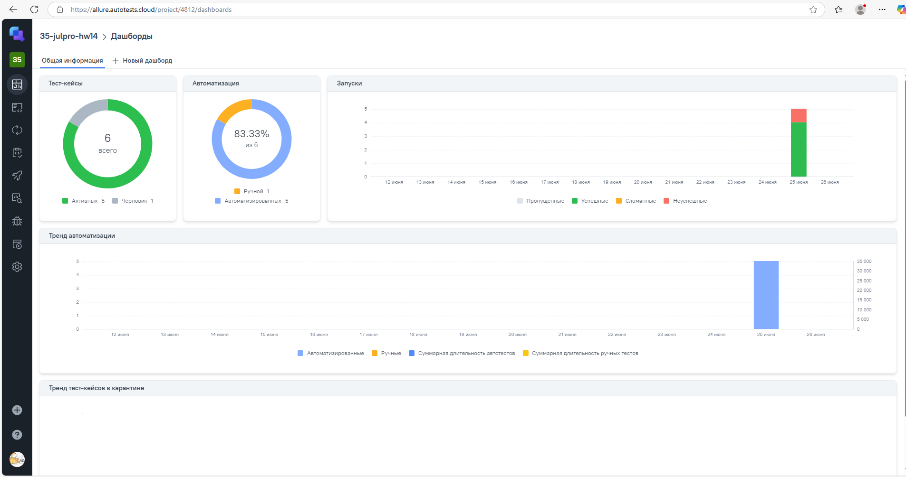

<p align="center">  

</p> 


# Проект по автоматизации тестирования для компании [BFS](https://bfs.su/)


## **Содержание:**
____

* <a href="#tools">Инструменты и технологии</a>

* <a href="#cases">Примеры автоматизированных тест-кейсов</a>

* <a href="#jenkins">Сборка в Jenkins</a>

* <a href="#console">Запуск из терминала</a>

* <a href="#allure">Allure отчет</a>

* <a href="#telegram">Уведомление в Telegram при помощи бота</a>

* <a href="#video">Примеры видео выполнения тестов на Selenoid</a>

* <a href="#integrations">Интеграция с Allure TestOps и Jira</a>
____
<a id="tools"></a>
## <a name="Технологии и инструменты">**Технологии и инструменты:**</a>


<p align="center">  
<a href="https://www.jetbrains.com/idea/"></a>  
<a href="https://www.java.com/"></a>  
<a href="https://github.com/"></a>  
<a href="https://junit.org/junit5/"></a>  
<a href="https://gradle.org/"></a>  
<a href="https://selenide.org/"></a>  
<a href="https://aerokube.com/selenoid/"></a>
<a href="https://www.jenkins.io/"></a>  
<a href="ht[images](images)tps://github.com/allure-framework/allure2"></a> 
<a href="https://qameta.io/"></a>
<a href="https://www.atlassian.com/ru/software/jira/"></a>  
</p>

- Автотесты написаны в <code>IntelliJ IDEA</code> на языке <code>Java</code> c помощью фреймворков <code>Selenide</code> и <code>JUnit 5</code>.
- При сборке проекта используется <code>Gradle</code>.
- При прогоне тестов браузер запускается в <code>Selenoid-контейнерах</code>.
- Для удаленного запуска реализована джоба в <code>Jenkins</code> с формированием Allure-отчета и автоматической отправкой результатов в <code>Telegram</code> (при помощи бота).
- Реализована интеграция с <code>Allure TestOps</code> и <code>Jira</code>.

____
<a id="cases"></a>
## <a name="Примеры автоматизированных тест-кейсов">**Примеры автоматизированных тест-кейсов:**</a>
____
- ✓ *Проверка отображения табов на главной странице сайта*
- ✓ *Проверка CookiePopup*
- ✓ *Проверка отображения формы ContactUs*
- ✓ *Проверка валидации формы ContactUs*
- ✓ *Проверка изменения языка*


____
<a id="jenkins"></a>
## </a><a name="Сборка"></a>Сборка в [Jenkins](https://jenkins.autotests.cloud/job/35-julpro-hw14/)</a>
____
<p align="center">  
<a href="https://jenkins.autotests.cloud/job/35-julpro-hw14/"></a>  
</p>


<a id="console"></a>
## Команды для запуска из терминала
___
***Локальный запуск:***
```bash  
gradle clean bfs_test
```

***Удалённый запуск через Jenkins:***
```bash  
clean
bfs_test
-Dbrowser=${BROWSER}
-DbrowserSize=${BROWSER_SIZE}
-DbrowserVersion=${BROWSER_VERSION}
-DselenoidHost=${SELENOIDE_HOST}
-Dlogin=${LOGIN}
-Dpass=${PASS}
```
___
<a id="allure"></a>
## </a> <a name="Allure"></a>Allure [отчет](https://jenkins.autotests.cloud/job/35-julpro-hw14/5/allure/)</a>
___

### *Основная страница отчёта*

<p align="center">  
  
</p>  

**Тест-кейсы** содержат в себе:
- Шаги теста
- Скриншот страницы на последнем шаге
- Page Source
- Логи браузерной консоли
- Видео прогона автотестов

<p align="center">  
  
</p>


____
<a id="telegram"></a>
## </a> Уведомление в Telegram при помощи бота
____
После завершения тестов: Telegram-бот отправляет уведомление с результатами и статистикой.
<p align="center">  
  
</p>

____
<a id="video"></a>
## </a> Примеры видео выполнения тестов на Selenoid
____

К каждому тесту в отчете прилагается видео его прохождения.
<p align="center">
   
</p>

___
<a id="integrations"></a>
## </a> </a> <a name="Интеграция с Allure TestOps и Jira"></a>Интеграция с [Allure TestOps и Jira](https://allure.autotests.cloud/project/4812/dashboards)</a>
___

### *Основные страницы*

<p align="center">  
  
</p>  


<p align="center">  
  
</p>


____